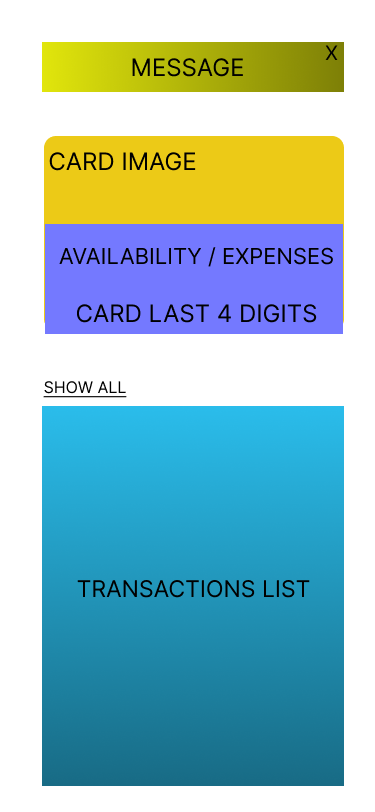

# Credit Card Owner Mobile app MVP

## Mockup

## Project requirements:
- Create a React Native application
- Use TypeScript as programming language
- Use git as version control system, create "isolated" commits

## Functional requirements (starting from the top of the proposed mockup):
1. Design and implement a box showing the title of the latest received message in the inbox:
    1. If the user presses the X placed in the top right corner of the box the app should ask the user whether he/she wants to permanently hide such box (confirmation causes the box to be hidden even during the next app launches)
    2. If the user presses the box the app should open a dismissible modal showing the title, the body and the date-time of the message
2. Design and implement a box showing card information (availability, expenses, last four digits), it should be an overlay over the credit card image
3. Design and implement a transactions list showing the latest three transactions. A transaction item in the list should be composed by information arranged on two lines. First line: merchant, amount and currency. Second line: location, date and status. A button placed above the list should allow the user to show all the transactions. The same button should permit to switch to the previous visualization (latest three transactions). 

## Non-functional requirements:
- Use transactions.json, inbox.json, cardInfo.json files as sample API responses to populate the UI. In order to consume these data in the app you need to implement one or more software components that mimic the behavior of a network web service response by adding a simulated delay of 1200, 400, 600 milliseconds respectively (don't use mock server or similar tools).
- Feel free to use colors, icons and UI components that better fit your needs and creativity  

## Nice to have: 
1) Unit tests of business logic/components
2) Make the second box (the one showing availability/expenses, last four digits) sticky to the top of the viewport when the user scrolls down the transactions list
3) Make the app run on web using [React Native for Web](https://necolas.github.io/react-native-web/)
